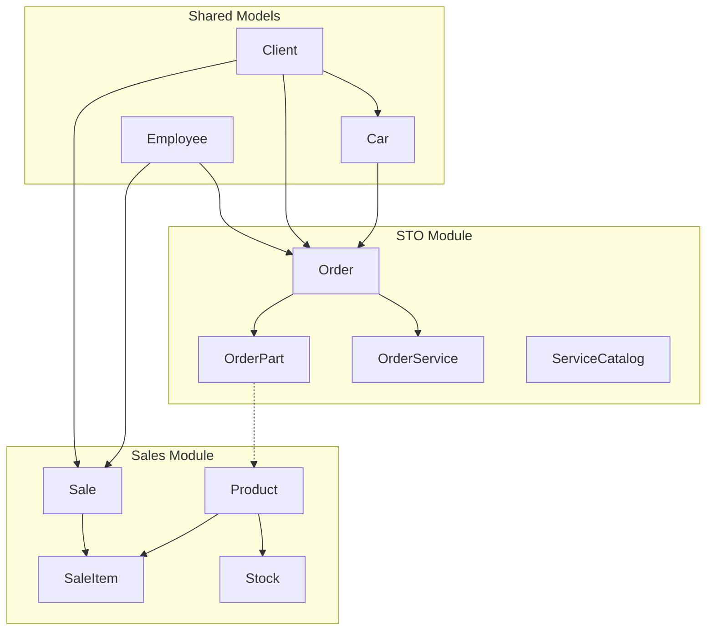

# 📁 Структура проекта СТО Management System v3.0

## 🗂️ Архитектура проекта

```
project/
├── shared_models/          # Общие модели для всех модулей
│   ├── __init__.py
│   ├── base.py            # Base, TimestampMixin
│   └── common_models.py   # Client, Car, Employee
│
├── sto_app/               # Модуль СТО
│   ├── __init__.py
│   ├── app.py            # STOApplication
│   ├── main_window.py    # MainWindow(QMainWindow)
│   ├── models_sto.py     # Order, OrderService, OrderPart, ServiceCatalog
│   │
│   ├── views/            # Представления (НУЖНО СОЗДАТЬ)
│   │   ├── __init__.py
│   │   ├── orders_view.py      # Таблица заказов + поиск/фильтры
│   │   ├── new_order_view.py   # Форма нового заказа
│   │   ├── catalogs_view.py    # Справочники (услуги, запчасти)
│   │   ├── clients_view.py     # Управление клиентами
│   │   ├── cars_view.py        # Управление автомобилями  
│   │   ├── employees_view.py   # Управление сотрудниками
│   │   └── settings_view.py    # Настройки приложения
│   │
│   ├── dialogs/          # Диалоговые окна (НУЖНО СОЗДАТЬ)
│   │   ├── __init__.py
│   │   ├── service_dialog.py   # Добавление/редактирование услуги
│   │   ├── part_dialog.py      # Добавление/редактирование запчасти
│   │   ├── client_dialog.py    # Создание/редактирование клиента
│   │   ├── car_dialog.py       # Добавление автомобиля
│   │   ├── employee_dialog.py  # Управление сотрудниками
│   │   └── order_details_dialog.py # Детали заказа
│   │
│   ├── widgets/          # Переиспользуемые виджеты (РЕКОМЕНДУЮ)
│   │   ├── __init__.py
│   │   ├── search_widget.py    # Виджет поиска
│   │   ├── filter_widget.py    # Виджет фильтров
│   │   ├── data_table.py       # Базовая таблица с сортировкой
│   │   └── status_badge.py     # Бейдж статуса заказа
│   │
│   ├── utils/            # Утилиты (РЕКОМЕНДУЮ)
│   │   ├── __init__.py
│   │   ├── validators.py       # Валидация данных
│   │   ├── formatters.py       # Форматирование (даты, суммы)
│   │   └── export.py          # Экспорт данных (PDF, Excel)
│   │
│   └── styles/
│       ├── __init__.py
│       ├── themes.py     # LIGHT_THEME, DARK_THEME
│       └── icons.py      # Константы иконок
│
├── sales_app/            # Модуль продаж (БУДУЩИЙ)
│   ├── __init__.py
│   ├── app.py           # SalesApplication
│   ├── main_window.py   # Окно продаж
│   ├── models_sales.py  # Product, Stock, Sale, Invoice
│   ├── views/
│   │   ├── __init__.py
│   │   ├── pos_view.py         # Точка продаж
│   │   ├── inventory_view.py   # Склад
│   │   └── reports_view.py     # Отчеты продаж
│   └── dialogs/
│       ├── __init__.py
│       ├── product_dialog.py   # Товары
│       └── sale_dialog.py      # Продажи
│
├── tests/                # Тесты (РЕКОМЕНДУЮ)
│   ├── __init__.py
│   ├── test_models.py    # Тесты моделей
│   ├── test_views.py     # Тесты UI
│   └── conftest.py       # Конфигурация pytest
│
├── docs/                 # Документация (РЕКОМЕНДУЮ)
│   ├── api.md           # API документация
│   ├── user_guide.md    # Руководство пользователя
│   └── deployment.md    # Инструкции по развертыванию
│
├── config/
│   ├── __init__.py
│   ├── database.py       # engine, SessionLocal, init_database()
│   └── settings.py       # Настройки приложения
│
├── resources/            # Ресурсы (РЕКОМЕНДУЮ)
│   ├── icons/           # Иконки
│   ├── images/          # Изображения
│   └── templates/       # Шаблоны отчетов
│
├── main.py              # Точка входа
├── init_db.py          # Инициализация БД
├── requirements.txt    # Зависимости
├── requirements-dev.txt # Зависимости для разработки
└── .env.example        # Пример файла окружения
```

## 🏗️ Архитектурные принципы

### Паттерн организации
- **MVV (Model-View-ViewModel)** для UI компонентов
- **Repository Pattern** для работы с данными
- **Dependency Injection** через конструкторы
- **Signal-Slot** для связи компонентов

### Соглашения по именованию
```python
# Классы: PascalCase
class OrdersView(QWidget):
    pass

# Методы и переменные: snake_case
def calculate_total_amount(self):
    pass

# Константы: UPPER_SNAKE_CASE
ORDER_STATUS_COLORS = {...}

# Приватные методы: _snake_case
def _setup_ui(self):
    pass

# Сигналы: snake_case с суффиксом
order_selected = Signal(int)
data_changed = Signal()
```

## 🔗 Основные классы и импорты

### Модели (SQLAlchemy)
```python
# Базовые (используются в обоих модулях)
from shared_models.base import Base, TimestampMixin
from shared_models.common_models import Client, Car, Employee

# СТО
from sto_app.models_sto import (
    Order, OrderStatus, OrderService, OrderPart, 
    ServiceCatalog, CarBrand
)

# Продажи (будущие)
from sales_app.models_sales import (
    Product, Stock, Sale, SaleItem, Invoice
)
```

### UI (PySide6)
```python
# Основные окна
from sto_app.main_window import MainWindow
from sto_app.app import STOApplication

# Views
from sto_app.views.orders_view import OrdersView
from sto_app.views.new_order_view import NewOrderView

# Dialogs
from sto_app.dialogs.client_dialog import ClientDialog
from sto_app.dialogs.service_dialog import ServiceDialog

# Виджеты
from sto_app.widgets.search_widget import SearchWidget
from sto_app.widgets.data_table import DataTable
```

### База данных
```python
from config.database import SessionLocal, get_db, init_database
from config.settings import DATABASE_URL, APP_SETTINGS
```

## 📊 Связи между модулями



**Связи:**
```
ОБЩИЕ МОДЕЛИ:
Client (1) ←→ (N) Car
Client (1) ←→ (N) Order (СТО)
Client (1) ←→ (N) Sale (Продажи)

СТО МОДУЛЬ:
Car (1) ←→ (N) Order
Order (1) ←→ (N) OrderService
Order (1) ←→ (N) OrderPart
Employee → Order (manager, responsible_person)

ПРОДАЖИ МОДУЛЬ:
Product (1) ←→ (N) Stock
Product (1) ←→ (N) SaleItem
Sale (1) ←→ (N) SaleItem
Employee → Sale (seller)

МЕЖМОДУЛЬНЫЕ СВЯЗИ:
OrderPart.article ←→ Product.article (по артикулу)
```

## 🎯 Статусы и Enums

### OrderStatus
```python
class OrderStatus(Enum):
    DRAFT = "Чернетка"
    IN_WORK = "В роботі"  
    WAITING_PAYMENT = "Очікує оплату"
    COMPLETED = "Завершено"
    CANCELLED = "Скасовано"
```

### CarBrand (будущий)
```python
class CarBrand(Enum):
    BMW = "BMW"
    MERCEDES = "Mercedes-Benz"
    AUDI = "Audi"
    VOLKSWAGEN = "Volkswagen"
    # ... другие марки
```

## 🔑 Ключевые методы

### Order (модель)
```python
def balance_due(self) -> Decimal:
    """Остаток к оплате"""
    
def calculate_total(self) -> Decimal:
    """Пересчет общей суммы заказа"""
    
def add_service(self, service: ServiceCatalog, quantity: int):
    """Добавить услугу в заказ"""
    
def add_part(self, name: str, price: Decimal, quantity: int):
    """Добавить запчасть в заказ"""
```

### MainWindow
```python
def new_order(self):
    """Создать новый заказ"""
    
def show_reports(self):
    """Показать отчеты"""
    
def change_theme(self, name: str):
    """Сменить тему оформления"""
    
def refresh_data(self):
    """Обновить данные во всех views"""
```

### BaseView (базовый класс для views)
```python
def setup_ui(self):
    """Настройка интерфейса"""
    
def load_data(self):
    """Загрузка данных"""
    
def refresh(self):
    """Обновление данных"""
    
def search(self, query: str):
    """Поиск по запросу"""
```

## 📝 Система сигналов Qt

### MainWindow
```python
theme_changed = Signal(str)  # Смена темы
module_changed = Signal(str)  # Переключение модуля
```

### OrdersView
```python
order_selected = Signal(int)  # Выбран заказ (ID)
order_deleted = Signal(int)   # Удален заказ
data_changed = Signal()       # Данные изменились
```

### NewOrderView  
```python
order_saved = Signal(int)     # Заказ сохранен (ID)
order_cancelled = Signal()    # Отмена создания
```

### Dialogs
```python
data_accepted = Signal(dict)  # Данные приняты
data_rejected = Signal()      # Отмена
```

## 🎨 UI/UX Guidelines

### Цветовая схема
```python
# Статусы заказов
ORDER_STATUS_COLORS = {
    OrderStatus.DRAFT: "#FFA500",        # Оранжевый
    OrderStatus.IN_WORK: "#1E90FF",      # Синий  
    OrderStatus.WAITING_PAYMENT: "#FFD700",  # Золотой
    OrderStatus.COMPLETED: "#32CD32",    # Зеленый
    OrderStatus.CANCELLED: "#DC143C"     # Красный
}

# Основная палитра
PRIMARY_COLOR = "#2196F3"    # Синий
SECONDARY_COLOR = "#FF9800"  # Оранжевый
SUCCESS_COLOR = "#4CAF50"    # Зеленый
WARNING_COLOR = "#FF5722"    # Красно-оранжевый
```

### Размеры и отступы
```python
# Отступы
MARGIN_SMALL = 8
MARGIN_MEDIUM = 16  
MARGIN_LARGE = 24

# Размеры кнопок
BUTTON_HEIGHT = 32
BUTTON_WIDTH_SMALL = 80
BUTTON_WIDTH_MEDIUM = 120

# Размеры таблиц
TABLE_ROW_HEIGHT = 32
TABLE_HEADER_HEIGHT = 40
```

## 🧪 Тестирование

### Структура тестов
```python
# test_models.py
def test_order_calculate_total():
    """Тест расчета суммы заказа"""
    
def test_order_balance_due():
    """Тест расчета остатка к оплате"""

# test_views.py  
def test_orders_view_load_data():
    """Тест загрузки данных в OrdersView"""
    
def test_new_order_view_save():
    """Тест сохранения нового заказа"""
```

## 📚 Примеры шаблонов

### Создание нового View
```python
# sto_app/views/example_view.py
from PySide6.QtWidgets import QWidget, QVBoxLayout
from PySide6.QtCore import Signal

class ExampleView(QWidget):
    # Сигналы
    data_changed = Signal()
    item_selected = Signal(int)
    
    def __init__(self, parent=None):
        super().__init__(parent)
        self.setup_ui()
        self.load_data()
    
    def setup_ui(self):
        """Настройка интерфейса"""
        layout = QVBoxLayout(self)
        # ... UI код
    
    def load_data(self):
        """Загрузка данных"""
        pass
    
    def refresh(self):
        """Обновление данных"""
        self.load_data()
```

### Создание нового Dialog
```python
# sto_app/dialogs/example_dialog.py
from PySide6.QtWidgets import QDialog, QVBoxLayout, QDialogButtonBox
from PySide6.QtCore import Signal

class ExampleDialog(QDialog):
    data_accepted = Signal(dict)
    
    def __init__(self, parent=None, item_id=None):
        super().__init__(parent)
        self.item_id = item_id
        self.setup_ui()
        if item_id:
            self.load_data()
    
    def setup_ui(self):
        """Настройка интерфейса"""
        layout = QVBoxLayout(self)
        
        # Кнопки
        self.buttons = QDialogButtonBox(
            QDialogButtonBox.Ok | QDialogButtonBox.Cancel
        )
        self.buttons.accepted.connect(self.accept_data)
        self.buttons.rejected.connect(self.reject)
        
        layout.addWidget(self.buttons)
    
    def accept_data(self):
        """Принять данные"""
        data = self.get_form_data()
        if self.validate_data(data):
            self.data_accepted.emit(data)
            self.accept()
    
    def get_form_data(self) -> dict:
        """Получить данные из формы"""
        return {}
    
    def validate_data(self, data: dict) -> bool:
        """Валидация данных"""
        return True
```

## 🚀 План развития

### Этап 1: Основные Views (Текущий)
- [ ] OrdersView - таблица заказов
- [ ] NewOrderView - форма нового заказа  
- [ ] ClientsView - управление клиентами

### Этап 2: Dialogs и детали
- [ ] ClientDialog, ServiceDialog, PartDialog
- [ ] Система поиска и фильтрации
- [ ] Экспорт данных

### Этап 3: Продвинутые функции
- [ ] Отчеты и аналитика
- [ ] Система уведомлений
- [ ] REST API

### Этап 4: Sales модуль
- [ ] POS система
- [ ] Управление складом
- [ ] Интеграция с СТО модулем
